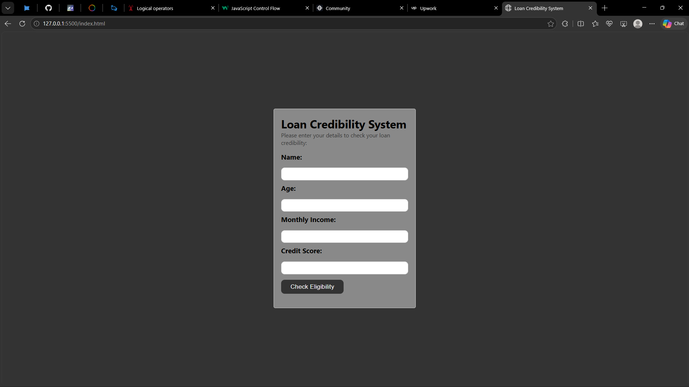

# Loan Credibility System

A simple loan credibility system built with HTML, CSS, and JavaScript.

This project allows users to enter information about their financial situation and checks their eligibility based on the conditions defined in the application.

## Features

* Collects user information through form inputs
* Evaluates the user's loan eligibility
* Uses predefined conditions to determine credibility
* Displays the result dynamically on the webpage
* Provides feedback based on the user's information
* Simple and user-friendly interface

## Technologies Used

* HTML
* CSS
* JavaScript

## What I Learned

* How to collect and work with user input using `.value`
* How to convert input values into numbers
* How to use comparison operators
* How to use logical operators such as `&&` and `||`
* How to use `if / else if / else` statements for decision-making
* How to combine multiple conditions in JavaScript
* How to display results dynamically on a webpage
* How to debug JavaScript logic
* How to build a small real-world application from scratch

## How It Works

The system takes the information entered by the user and evaluates it against the conditions defined in the JavaScript code.

Based on the results of these checks, the system provides feedback on whether the user meets the requirements for the loan.

## Preview

## How to Run

1. Clone this repository.
2. Open the project folder in VS Code.
3. Open `index.html` in your browser.
4. Enter the required information.
5. Submit the form to see the result.

## Project Purpose

This project was built as part of my journey learning JavaScript and software development.

The goal was to practice working with user input, comparison operators, logical operators, conditional statements, and dynamic webpage updates while building something based on a real-world scenario.

## Disclaimer

This project is a learning project and is **not a real financial or lending service**.

The eligibility result is based only on the conditions programmed into the application and should not be considered professional financial advice or an actual loan approval decision.

## Author

**Efeose Isibor**

Learning, building, and improving one project at a time. 🚀
